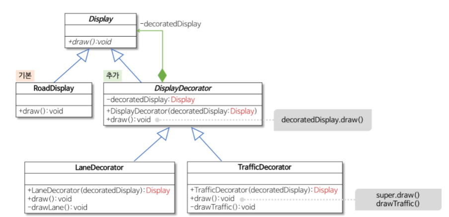

# 전략 패턴

- 콘텍스트 클래스와 전략 인터페이스가 존재한다.
- 콘텍스트는 전략을 DI 를 통해 의존한다.

### 느낌

- 다양한 상황에 대한 객체의 변화를 요할 때 사용하면 좋을 것 같다.
- 특별한 디자인 패턴이라기 보다는 전략으로의 추상화가 유리한 상황을 말하는 것 같다.
- 예제 : 첫번째 손님 , 마지막 손님 등등 손님에 대한 고려 + 신선한 정도 고려 많은 것을 고려할때 전략으로의 추상화가 유리함

<br></br>
***
<br></br>

# 템플릿 메서드 패턴

### 템플릿 메서드란

- 실행 과정에 대한 틀을 상위 클래스의 템플릿 메서드와 훅메서드로 정의하고 이를 상속하는 하위 클래스에서는 훅메서드를 각각에 맞게 오버라이딩 해서 사용하는 패턴
- 실행 과정 / 단계 (틀) 이 동일한데 각 단계중 일부의 구현이 다른경우 사용할 수 있음

### 템플릿 메서드 특징

- 실행 과정을 구현한 상위 클래스 , 샐행 과정의 일부 단계를 구현한 하위 클래스로 구성
- 하위타입에서의 구현 메서드를 훅 메서드라고 함
- 기본적인 틀인 템플릿 메서드는 public 으로 고정 , 하위 클래스마다 다를 수 있는 부분은 abstract 메서드로 선언
- 상위 타입의 템플릿 메서드가 흐름을 제어, 하위 타입의 구현 메서드가 템플릿 메서드에서 호출 되느 구조

```

abstract class Authenticator {
    
    // 템플릿 메서드
    fun authenticate(id: String, pw: String): Auth {
        if (!doAuthenticate(id, pw)){
            throw createException()
        }
        
        return createAuth(id)
    }
    
    // 하위 클래스에서 제 정의 할 메서드
    // 훅메서드라고도 함
    protected abstract fun doAuthenticate(id: String  , pw:String)

    private fun createException : RuntimeException(){
        throw AuthException()
    }
    
    // 하위 클래스에서 제 정의 할 메서드
    // 훅메서드라고도 함
    protected  abstract  fun createAuth (id : String) : Auth
}

```

<br></br>
***
<br></br>

# 상태 패턴

### 상태패턴이란?

context class 에서 맴버 변수로 상태를 갖고 상태들은 상태 인터페이스 기능이 상태에 따라 다르게 동작해야할 때 사용하는 패턴

전략패턴과 매우 유사함

<br></br>
***
<br></br>

# 데코레이트 패턴

상속이 아닌 위임의 방식으로 기본 기능에 여러 종류의 기능을 추가하여 사용할 수 있는 패턴이다.

### UML



### 동작 순서

1. Decorator 의 상속 클래스의 draw 매서드가 발생
2. draw 조합하고 하고사자는 기능1을 수행한 결과 도출
3. 결과를 Decorator 로 부터 상속 받은 doDelegate 를 통해 Concreate의 draw의 인자로 들어감
4. concreate 클래스 에서 정의한 기본 동작 수행

- 만약 기능이 추가된다면 바깥에서부터 타고 타고 올라가면서 수행하게됨
- 차선 표시 한 데이터 -> 차선 표시 + 교통량 표시 한 데이터 -> 차선 표시 + 교통량 표시 한 데이터 를 출력

```
val roadWithTraffic: Display = LaneDecorator(TrafficDecorator(RoadDisplay()))
```  

```
    fun main(args: Array<String>) {
        val road: Display = RoadDisplay()
        road.draw() // 기본 도로 표시
        val roadWithLane: Display = LaneDecorator(RoadDisplay())
        roadWithLane.draw() // 기본 도로 표시 + 차선 표시  -> 순서상 반대
        val roadWithTraffic: Display = LaneDecorator(TrafficDecorator(RoadDisplay()))
        roadWithTraffic.draw() // 기본 도로 표시 + 교통량 표시 + 차선 표시 -> 순서상 반대
    }
```

